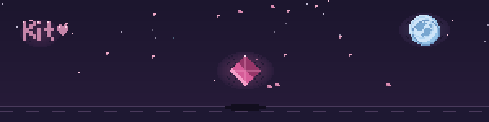

  

### Hi, I'm Kit 🌸

<table>
  <tr>
    <td valign="middle">
      I build small, useful tools by day and games by night — practical little
      helpers that smooth out the boring parts, and worlds worth getting lost in.
    </td>
    <td align="center" width="150">
       
      <i>me, most days</i>
    </td>
  </tr>
</table>

<table>
  <tr>
    <td align="center" width="130">
       
      <i>debugging at 2am</i>
    </td>
    <td valign="middle">
      My best ideas turn up somewhere between midnight and "wait, why is this broken?"
      If it compiles on the first try, I get suspicious.
    </td>
  </tr>
</table>

  
  &nbsp;
  

<b>When I'm not shipping tools, I'm building games.</b>

  

